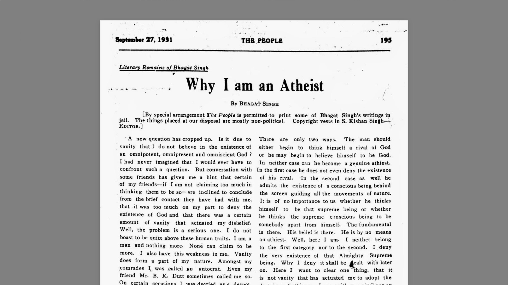

Bhagat Singh was 23 years old when he is supposed to have written his essay on 'Why I Am An Atheist'

{loading=eager}

> Criticism and independent thinking are the two indispensable qualities of a revolutionary. Because Mahatamaji is great, therefore none should criticise him. Because he has risen above, therefore everything he says —may be in the field of Politics or Religion, Economics or Ethics— is right. Whether you are convinced or not you must say: "Yes, that's true". This mentality does not lead towards progress. It is rather too obviously reactionary.
>
> […] Any man who stands for progress has to criticise, disbelieve and challenge every item of the old faith. Item by item he has to reason out every nook and corner of the prevailing faith. If after considerable reasoning one is led to believe in any theory or philosophy, his faith is welcomed. His reasoning can be mistaken, wrong, misled, and sometimes fallacious. But he is liable to correction because reason is the guiding star of his life. But mere faith and blind faith is dangerous: it dulls the brain and makers a man reactionary. A man who claims to be a realist has to challenge the whole of the ancient faith. If it does not stand the onslaught of reason it crumbles down.

> […] Poverty is a sin, it is a punishment. I ask you how far would you appreciate a criminologist, a jurist or a legislator who proposes such measures of punishment which shall inevitably force men to commit more offences. Had not your God thought of this, or he also had to learn these things by experience, but at the cost of untold sufferings to be borne by humanity?
>
> […] As regards the origin of God, my own idea is that having realised the limitation of man, his weaknesses and shortcoming having been taken into consideration, God was brought into imaginary existence to encourage man to face boldly all the trying circumstances, to meet all dangers manfully and to check and restrain his outbursts in prosperity and affluence. God, both will his private laws and parental generosity, was imagined and painted in greater details. He was to serve as a deterrent factor when his fury and private laws were discussed, so that man may not become a danger to society. He was to serve as a father, mother, sister and brother, friend and helper, when his parental qualifications were to be explained. So that when man be in great distress, having been betrayed and deserted by all friends, he may find consolation in the idea that an ever-true friend, was still there to help him, to support him and that he was almighty and could do anything. Really that was useful to the society in the primitive age. The idea of God is helpful to man in distress.
